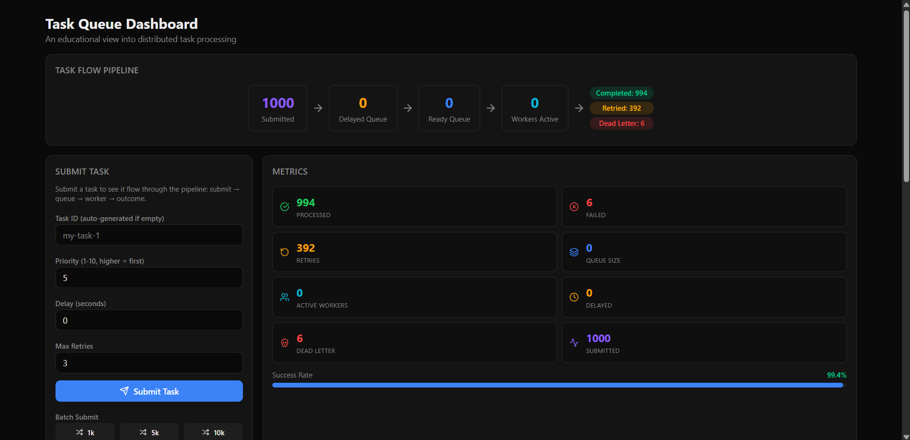
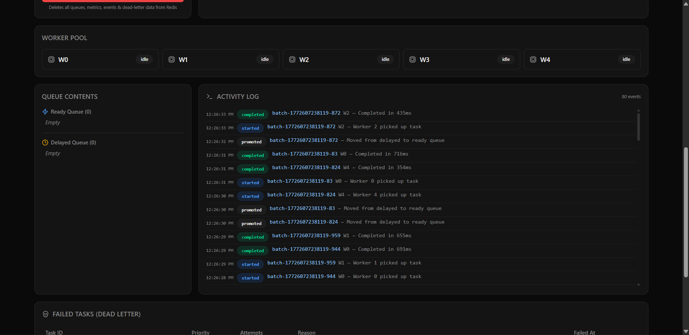
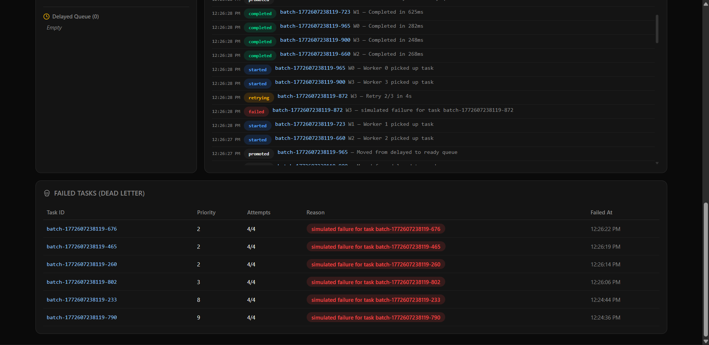
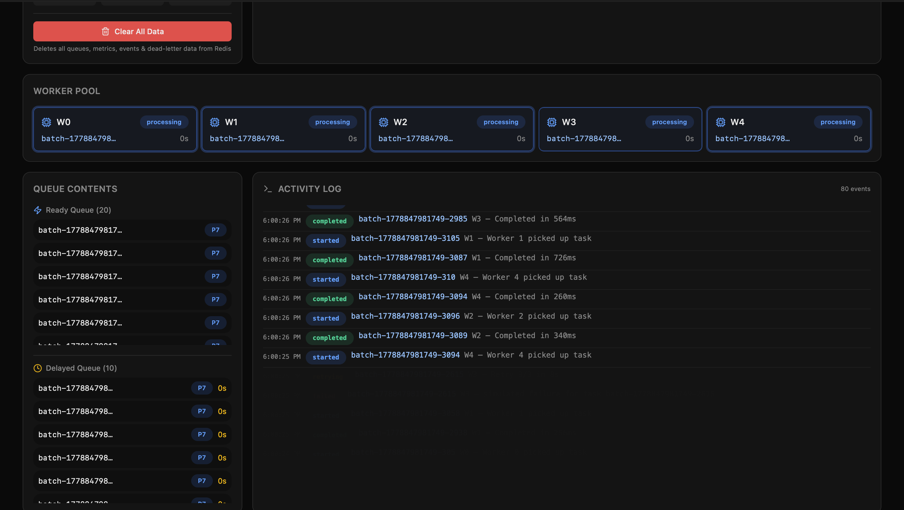
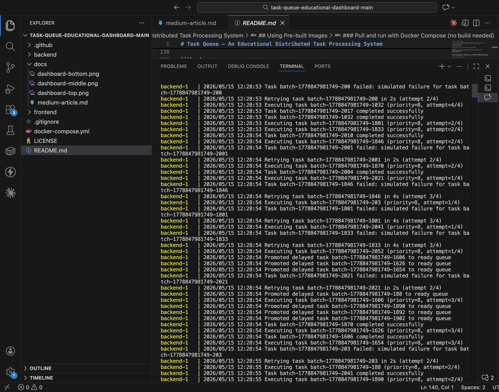
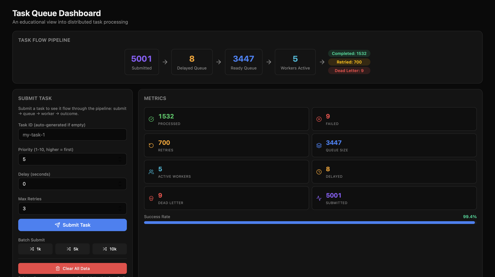

# Task Queue Dashboard — Architecture & Design Document

**Author:** Aditya Kumar  
**Repository:** https://github.com/Destructor169/task-queue-dashboard  
**Date:** May 15, 2026  
**License:** MIT

---

## 📋 Table of Contents

1. [Overview](#overview)
2. [System Architecture](#system-architecture)
3. [Core Components](#core-components)
4. [Data Structures & Storage](#data-structures--storage)
5. [Task Lifecycle](#task-lifecycle)
6. [Dashboard & Visualization](#dashboard--visualization)
7. [Real-time Communication](#real-time-communication)
8. [Retry & Exponential Backoff](#retry--exponential-backoff)
9. [Error Handling & Dead-Letter Queue](#error-handling--dead-letter-queue)
10. [Performance Considerations](#performance-considerations)
11. [Deployment Architecture](#deployment-architecture)

---

## Overview

**Task Queue Dashboard** is an educational distributed task processing system that visualizes every stage of task processing in real-time. It demonstrates core concepts used in production systems like:

- Amazon SQS
- RabbitMQ
- Celery
- Bull Queue
- Apache Kafka

### Key Features

✅ **Priority-based scheduling** — Higher priority tasks execute first  
✅ **Delayed execution** — Schedule tasks for future execution  
✅ **Automatic retries** — Exponential backoff with configurable max attempts  
✅ **Dead-letter queue** — Permanently failed tasks stored separately  
✅ **Real-time dashboard** — Watch tasks flow through the system live  
✅ **Worker pool** — Configurable concurrent worker goroutines  
✅ **Event streaming** — Full audit trail of task lifecycle  
✅ **Single-command setup** — `docker compose up` gets everything running  

### Technology Stack

| Component | Technology | Version |
|-----------|-----------|---------|
| **Backend API** | Go | 1.22 |
| **Frontend Dashboard** | Next.js + React | 15 / 19 |
| **Message Queue** | Redis Sorted Sets | 7 |
| **Containerization** | Docker | Latest |
| **Orchestration** | Docker Compose | Latest |

---

## System Architecture

### High-Level Diagram

```
┌──────────────────────────────────────────────────────────────┐
│                     CLIENT LAYER                              │
│  ┌──────────────────────────────────────────────────────┐    │
│  │    Next.js 15 Frontend Dashboard (React 19)          │    │
│  │    - Real-time polling (HTTP REST)                   │    │
│  │    - Framer Motion animations                        │    │
│  │    - Tailwind CSS + shadcn/ui components             │    │
│  │    - Port: 3000                                      │    │
│  └──────────────────────────────────────────────────────┘    │
└────────────────────────────┬─────────────────────────────────┘
                             │ HTTP REST API
                             │ (Port 8080)
┌────────────────────────────▼─────────────────────────────────┐
│                    APPLICATION LAYER                          │
│  ┌──────────────────────────────────────────────────────┐    │
│  │          Go 1.22 Backend Server                      │    │
│  │  ┌────────────────────────────────────────────────┐  │    │
│  │  │  HTTP Router & Handlers                        │  │    │
│  │  │  - Task submission (/api/tasks)                │  │    │
│  │  │  - Metrics retrieval (/api/metrics)            │  │    │
│  │  │  - Event streaming (/api/events)               │  │    │
│  │  │  - Worker state (/api/workers)                 │  │    │
│  │  │  - Queue peek (/api/queues)                    │  │    │
│  │  │  - Dead-letter tasks (/api/tasks/failed)       │  │    │
│  │  └────────────────────────────────────────────────┘  │    │
│  │                       │                               │    │
│  │  ┌────────────────────┼────────────────────────────┐  │    │
│  │  │                    │                            │  │    │
│  │  ▼                    ▼                            ▼  │    │
│  │  ┌──────────┐    ┌──────────┐    ┌───────────────┐  │    │
│  │  │Worker    │    │Delayed   │    │Priority Queue │  │    │
│  │  │Pool      │    │Scheduler │    │Manager        │  │    │
│  │  │(5 x Go   │    │(1s tick) │    │(ZADD/ZPOPMIN)│  │    │
│  │  │goroutines)   │          │    │               │  │    │
│  │  └──────────┘    └──────────┘    └───────────────┘  │    │
│  └────────────────────────────────────────────────────┘  │    │
└────────────────────────────┬─────────────────────────────────┘
                             │ Redis Client (port 6379)
┌────────────────────────────▼─────────────────────────────────┐
│                    DATA STORAGE LAYER                         │
│  ┌──────────────────────────────────────────────────────┐    │
│  │              Redis 7 In-Memory Store                 │    │
│  │                                                      │    │
│  │  Ready Queue (ZSET)     Score = -priority           │    │
│  │  Delayed Queue (ZSET)   Score = unix_timestamp      │    │
│  │  Metrics (HASH)         field:value pairs           │    │
│  │  Events (LIST)          Append-only activity log    │    │
│  │  Dead-Letter Queue (LIST) Permanently failed tasks  │    │
│  │  Worker States (HASH)   Per-worker status           │    │
│  └──────────────────────────────────────────────────────┘    │
└──────────────────────────────────────────────────────────────┘
```

### Container Architecture

```
docker-compose.yml
│
├── redis:7-alpine (Port 6379)
│   └── In-memory data store, queue engine
│
├── taskqueue-backend:latest (Port 8080)
│   └── Go application with worker pool
│       ├── 5 worker goroutines
│       ├── Delayed scheduler (1s ticker)
│       └── HTTP API server
│
└── taskqueue-frontend:latest (Port 3000)
    └── Next.js standalone server
        ├── React components
        └── API polling (1s-5s intervals)
```

---

## Core Components

### 1. **Backend Server** (`cmd/server/main.go`)

Entry point that orchestrates all components:

```go
// Initialization order
Redis Client
    ↓
Stores (Metrics, Events, DeadLetter, etc.)
    ↓
Priority Queue + Delayed Scheduler
    ↓
Worker Executor
    ↓
Worker Pool (N goroutines)
    ↓
HTTP Router & Handlers
    ↓
Graceful Shutdown (signal handling)
```

**Responsibilities:**
- Dependency injection & wiring
- Graceful shutdown with context propagation
- Signal handling (SIGINT, SIGTERM)
- Startup logging

---

### 2. **Priority Queue** (`internal/queue/queue.go`)

Manages the ready-to-process task queue using Redis sorted sets.

**Data Structure:**
```
Redis ZSET: "queue:ready"
  Member: JSON-serialized Task
  Score:  -task.priority  (lower score = higher priority)
```

**Operations:**

| Operation | Redis Command | Complexity |
|-----------|---------------|-----------|
| Enqueue | `ZADD` | O(log N) |
| Dequeue | `ZPOPMIN` | O(log N) |
| Size | `ZCARD` | O(1) |
| Peek | `ZRANGE` | O(log N + M) |

**Why this design?**
- ✅ Atomic dequeue (single worker gets each task)
- ✅ O(log N) insertion/deletion
- ✅ Automatic sorting by priority
- ✅ No duplicate processing

---

### 3. **Delayed Scheduler** (`internal/queue/delayed.go`)

Manages tasks scheduled for future execution.

**Data Structure:**
```
Redis ZSET: "queue:delayed"
  Member: JSON-serialized Task
  Score:  unix_timestamp (when task should execute)
```

**Process Flow:**
1. **Every 1 second** — Check for tasks where `score <= now()`
2. **Batch promotion** — Move up to 100 due tasks to ready queue
3. **Event emission** — Log "promoted" event for each task

**Algorithm:**
```go
// Pseudo-code
func promoteDueTasks() {
    now := time.Now().Unix()
    
    // Get all tasks where score <= now (sorted ascending)
    results := redis.ZRangeByScore(
        min: "-inf",
        max: now,
        limit: 100
    )
    
    for each result {
        // Atomic remove + re-enqueue
        removed := redis.ZRem("queue:delayed", task)
        if removed > 0 {
            redis.ZAdd("queue:ready", task)
            emitEvent("promoted")
        }
    }
}
```

---

### 4. **Worker Pool** (`internal/worker/pool.go`)

Manages N concurrent goroutines that process tasks.

**Configuration:**
- Default workers: **5**
- Poll interval: **500ms** (configurable)
- Each worker runs independently

**Worker Loop:**
```go
func worker(id int) {
    for {
        select {
        case <-ctx.Done():
            return  // Graceful shutdown
        default:
        }
        
        // Poll queue
        task, err := queue.Dequeue()
        if task == nil {
            sleep(pollInterval)
            continue
        }
        
        // Execute task
        executor.Execute(task, workerID)
    }
}
```

**Key Features:**
- ✅ Graceful shutdown with `sync.WaitGroup`
- ✅ Worker state tracking (idle/processing)
- ✅ Non-blocking context checks
- ✅ Backpressure via poll interval

---

### 5. **Task Executor** (`internal/worker/executor.go`)

Executes individual tasks and handles success/failure.

**Execution Flow:**

```
Task received
    ↓
Set worker state → "processing"
    ↓
Emit "started" event
    ↓
Simulate work (200-800ms random duration)
    ↓
Determine outcome (70% success, 30% failure)
    ├─ SUCCESS:
    │  ├─ Set status → "completed"
    │  ├─ Emit "completed" event
    │  └─ Increment processed counter
    │
    └─ FAILURE:
       ├─ Emit "failed" event
       ├─ Check retries left?
       │  ├─ YES: Schedule retry (exponential backoff)
       │  │  ├─ Increment retry counter
       │  │  ├─ Calculate backoff: min(2^n * 1s, 60s)
       │  │  ├─ Add to delayed queue
       │  │  └─ Emit "retrying" event
       │  │
       │  └─ NO: Dead-letter
       │     ├─ Add to dead-letter store
       │     ├─ Emit "dead_lettered" event
       │     └─ Increment failed counter

Set worker state → "idle"
```

**Simulated Failure Rate:** ~30% (intentional for demo purposes)

---

### 6. **HTTP API Server** (`internal/api/handler.go`)

Serves REST endpoints for dashboard interaction.

**Handler Structure:**
```go
type Handler struct {
    queue      *queue.PriorityQueue
    delayed    *queue.DelayedScheduler
    deadLetter *store.DeadLetterStore
    metrics    *store.MetricsStore
    pool       *worker.Pool
    redis      *redis.Client
    events     *store.EventStore
    workerState *store.WorkerStateStore
    queuePeek  *store.QueuePeekStore
}
```

---

## Data Structures & Storage

All state lives in **Redis**. No database, no files.

### Redis Keys & Data Structures

| Key | Type | Purpose | Example Score/Field |
|-----|------|---------|-------------------|
| `queue:ready` | ZSET | Tasks ready to execute | Score = -priority (1-10) |
| `queue:delayed` | ZSET | Tasks scheduled for future | Score = unix_timestamp |
| `metrics` | HASH | Counter aggregates | `{total_processed: 1500}` |
| `events` | LIST | Activity log (capped) | Append-only, LTRIM to 200 |
| `deadletter:queue` | LIST | Failed tasks | Append-only |
| `worker:states` | HASH | Per-worker status | `{worker_0: {...}, ...}` |

### Task Model

```go
type Task struct {
    ID         string    // Unique identifier
    Priority   int       // 1-10, higher = first
    Delay      int       // Seconds before ready
    MaxRetries int       // Total retry attempts
    Retries    int       // Current attempt count
    Status     string    // pending/processing/completed/failed
    CreatedAt  time.Time
    Error      string    // Failure reason
}
```

### Event Model

```go
type TaskEvent struct {
    ID        string    // Event UUID
    TaskID    string    // Which task
    Type      string    // submitted/started/completed/failed/retrying/dead_lettered/promoted
    WorkerID  int       // Which worker (or -1 for system)
    Detail    string    // Human-readable message
    Timestamp time.Time
}
```

---

## Task Lifecycle

### Complete Flow Diagram

```
┌─────────────────────────────────────────────────────────────┐
│ 1. SUBMISSION                                               │
│    POST /api/tasks {"id": "task-1", "priority": 8, ...}    │
│    └─ Event: "submitted"                                    │
└─────────────┬───────────────────────────────────────────────┘
              │
              ▼
┌─────────────────────────────────────────────────────────────┐
│ 2. ROUTING                                                  │
│    if delay > 0:                                            │
│      └─ Add to delayed:queue (score = now + delay)          │
│    else:                                                    │
│      └─ Add to ready:queue (score = -priority)              │
│    └─ Event: "promoted" (only if delayed)                   │
└─────────────┬───────────────────────────────────────────────┘
              │
              ▼
┌─────────────────────────────────────────────────────────────┐
│ 3. WORKER PICKUP                                            │
│    Worker polls ready:queue via ZPOPMIN (500ms interval)    │
│    └─ Event: "started" + worker_id                          │
└─────────────┬───────────────────────────────────────────────┘
              │
              ▼
┌─────────────────────────────────────────────────────────────┐
│ 4. EXECUTION                                                │
│    Sleep 200-800ms (simulated work)                         │
│    Random failure (30% rate for demo)                       │
└─────────────┬───────────────────────────────────────────────┘
              │
              ├─────────────────────┬───────────────────────┐
              ▼ (70% success)       ▼ (30% failure)
              │                     │
         ┌────────────────┐    ┌─────────────────────┐
         │ 5A. SUCCESS    │    │ 5B. FAILURE         │
         │                │    │                     │
         │ Status:        │    │ Check retries left? │
         │ COMPLETED      │    │                     │
         │                │    └────────┬────────────┘
         │ Event:         │             │
         │ "completed"    │         ┌───┴───┐
         │                │         │       │
         │ Metrics:       │    YES (1)  NO (2)
         │ +processed     │     │       │
         │                │     │       │
         └────────────────┘     │       │
              │                 │       │
              │                 ▼       ▼
              │            ┌──────┐ ┌──────────────┐
              │            │ 6A.  │ │ 6B. DEAD-    │
              │            │RETRY │ │ LETTER       │
              │            │      │ │              │
              │            │Add to│ │Add to        │
              │            │delayed│ │deadletter   │
              │            │queue │ │              │
              │            │      │ │Event:        │
              │            │Backoff│ │dead_lettered│
              │            │2^n   │ │              │
              │            │secs  │ │Metrics:     │
              │            │      │ │+failed      │
              │            │Event:│ └──────────────┘
              │            │retrying            │
              │            │      │              │
              │            │Metrics│              │
              │            │+retries            │
              │            │      │              │
              │            └──────┘              │
              │               │                  │
              │               └──────┬───────────┘
              │                      │
              └──────────────────────┼──────┐
                                     │      │
                            ┌────────▼──┐ ┌▼──────────┐
                            │ DASHBOARD │ │ METRICS   │
                            │ UPDATES   │ │ UPDATED   │
                            │ (Polled   │ └───────────┘
                            │ 1-5s)     │
                            └───────────┘
```

### Example Timeline

```
Time  Event              Task State          Queue State
─────────────────────────────────────────────────────────
0s    submitted          pending             ready:1
0s    started (W0)       processing          ready:0
0.5s  completed          completed           ready:0
      ✓ Metrics: +processed

1s    submitted          pending             ready:1
1s    started (W1)       processing          ready:0
1.4s  failed            failed (retry 1)     delayed:1, ready:0
      Event: retrying (backoff: 2s)
      ✓ Metrics: +retries

3.4s  promoted          pending             ready:1
3.5s  started (W2)      processing          ready:0
3.9s  failed            failed (retry 2)     delayed:1, ready:0
      Event: retrying (backoff: 4s)
      ✓ Metrics: +retries

7.9s  promoted          pending             ready:1
8s    started (W3)      processing          ready:0
8.6s  failed            failed (max)         deadletter:1, ready:0
      Event: dead_lettered
      ✓ Metrics: +failed
```

---

## Dashboard & Visualization

### Dashboard Panels

#### 1. **Task Flow Pipeline** (3s poll)
Visual representation of task distribution across queues.

```
┌────────────┐    ┌────────────┐    ┌────────────┐
│  SUBMITTED │ → │ DELAYED QU │ → │ READY QUE  │
│     42     │    │     8      │    │     5      │
└────────────┘    └────────────┘    └────────────┘
                                           ↓
                                    ┌────────────┐    ┌────────────┐
                                    │ PROCESSING │ → │ COMPLETED  │
                                    │     3      │    │   1847     │
                                    └────────────┘    └────────────┘
                                           │
                                    ┌────────────┐
                                    │ DEAD-LET   │
                                    │     12     │
                                    └────────────┘
```

#### 2. **Submit Form**
- Single task: ID, Priority (1-10), Delay (0-60s), Max Retries (0-5)
- Batch operations: 1k, 5k, 10k with configurable parameters
- Clear All Data (with confirmation)

#### 3. **Metrics Panel** (3s poll)
8 stat cards with real-time counters:

```
┌─────────────────┐  ┌─────────────────┐
│  ✓ PROCESSED    │  │  ✗ FAILED       │
│     1,847       │  │      12         │
└─────────────────┘  └─────────────────┘

┌─────────────────┐  ┌─────────────────┐
│  ↻ RETRIES      │  │  □ QUEUE SIZE   │
│      89         │  │      3          │
└─────────────────┘  └─────────────────┘

Plus: Active Workers, Success Rate %, etc.
```

#### 4. **Worker Pool Panel** (1s poll - fastest)
Real-time worker status with animations.

```
┌─────────────┐  ┌─────────────┐  ┌─────────────┐
│  W0: idle   │  │ W1: running │  │  W2: idle   │
│             │  │ task-42     │  │             │
│             │  │ +2.3s       │  │             │
└─────────────┘  └─────────────┘  └─────────────┘

Worker state changes trigger blue pulse animation
```

#### 5. **Queue Contents** (2s poll)
Peek into ready and delayed queues with countdown timers.

#### 6. **Activity Log** (1s poll)
Terminal-style event stream:

```
[12:24:59] ✓ task-42 | submitted | Priority: 8
[12:25:00] ▶ task-42 | started   | Worker: 0
[12:25:01] ✗ task-42 | failed    | Attempt: 1/3
[12:25:01] ↻ task-42 | retrying  | In 2s
[12:25:03] ◀ task-42 | promoted  | From delayed
[12:25:03] ▶ task-42 | started   | Worker: 2
[12:25:04] ✓ task-42 | completed | Duration: 1.2s
```

#### 7. **Failed Tasks Table** (5s poll)
Dead-letter queue with full task details and failure reasons.

---

## Real-time Communication

### Frontend Polling Strategy

```typescript
// Different components poll at different rates
// optimized for responsiveness vs. load

TaskFlowDiagram:     3s interval (not critical)
MetricsPanel:        3s interval (aggregate stats)
WorkerPoolPanel:     1s interval (animation timing)
ActivityLog:         1s interval (event stream)
QueuePanel:          2s interval (queue visibility)
FailedTasksPanel:    5s interval (historical data)
```

### API Response Format

All endpoints return JSON with consistent structure:

```typescript
// Task endpoint
GET /api/tasks/failed?offset=0&limit=20
{
  tasks: [
    {
      id: "task-1",
      priority: 8,
      status: "failed",
      retries: 2,
      max_retries: 3,
      error: "simulated failure",
      created_at: "2026-05-15T12:24:59Z"
    }
  ]
}

// Metrics endpoint
GET /api/metrics/enhanced
{
  total_processed: 1847,
  total_failed: 12,
  total_retries: 89,
  queue_size: 3,
  active_workers: 2,
  success_rate: 99.4,
  delayed_queue_size: 1,
  dead_letter_size: 12,
  total_submitted: 1871
}

// Events endpoint
GET /api/events?limit=50
[
  {
    id: "evt-1234567890",
    task_id: "task-42",
    type: "submitted",
    worker_id: -1,
    detail: "Task submitted via API",
    timestamp: "2026-05-15T12:24:59Z"
  },
  ...
]
```

---

## Retry & Exponential Backoff

### Algorithm

When a task fails and retries remain:

```go
backoffSeconds := math.Min(
    math.Pow(2, float64(task.Retries)),  // 2^attempt
    60,                                  // Max 60s
)

// Example progression:
// Attempt 1: 2^1  = 2 seconds
// Attempt 2: 2^2  = 4 seconds
// Attempt 3: 2^3  = 8 seconds
// Attempt 4: 2^4  = 16 seconds
// Attempt 5: 2^5  = 32 seconds
// Attempt 6: 2^6  = 64 seconds (capped to 60)
// Attempt 7: 2^7  = 128 seconds (capped to 60)
```

### Visual Timeline

```
Task fails (attempt 1)
        │
        ├─ Add to delayed queue with score = now + 2s
        ├─ Event: "retrying" | detail: "Retry 1/3 in 2s"
        └─ Metrics: +retries
                │
        ┌───────┴───────┐
        │ (wait 2 sec)  │
        ▼               
Promoted from delayed ──┐
        │                │
        ├─ Event: "promoted"
        ├─ Add to ready queue
        └─ Worker picks up
                │
        Task fails again (attempt 2)
        │
        ├─ Add to delayed queue with score = now + 4s
        ├─ Event: "retrying" | detail: "Retry 2/3 in 4s"
        └─ Metrics: +retries
                │
        ┌───────┴───────┐
        │ (wait 4 sec)  │
        ▼               
        ...

After max retries exhausted
        │
        └─ Add to dead-letter queue
           Event: "dead_lettered"
           Metrics: +failed
```

---

## Error Handling & Dead-Letter Queue

### Dead-Letter Queue (DLQ) Pattern

The DLQ stores permanently failed tasks for manual inspection:

```
Redis LIST: "deadletter:queue"

Each entry:
{
  task: {
    id: "task-42",
    priority: 5,
    max_retries: 3,
    retries: 3,        // exhausted
    status: "failed",
    error: "simulated failure"
  },
  failed_at: "2026-05-15T12:25:10Z",
  reason: "Max retries exceeded"
}
```

### Why DLQ?

1. **Audit Trail** — Track which tasks failed and why
2. **Manual Intervention** — Operators can inspect and resubmit
3. **Alerting** — Monitor DLQ size for system health
4. **Separate Storage** — Don't lose data on queue overflow

---

## Performance Considerations

### Throughput Analysis

With **5 workers** at **500ms poll interval**:

```
Best case (all succeed):
  - 5 workers × 1 task/worker
  - 200-800ms per task (avg 500ms)
  - Throughput ≈ 5-10 tasks/sec
  
Realistic (70% success):
  - Some tasks retry, occupying workers longer
  - Effective throughput ≈ 3-7 tasks/sec

Peak load testing (1k tasks):
  - Ramps up quickly
  - Levels off around 5-7 tasks/sec
  - Retries cause backpressure
```

### Redis Performance

**Sorted Set Operations:**
- `ZADD` (enqueue): O(log N)
- `ZPOPMIN` (dequeue): O(log N)
- `ZRangeByScore` (promotion): O(log N + M)

**Typical Redis Throughput:**
- 100k+ operations/sec on modern hardware
- No bottleneck for this use case

### Frontend Polling

**Network Impact:**
- 6 dashboard panels polling at 1-5s intervals
- Average ~10 HTTP requests/sec at peak
- Each response ~1-5KB

**Total Data Transfer:**
- 10 requests × 2KB = ~20KB/sec = **160 Kbps** (minimal)

---

## Deployment Architecture

### Local Development
```
docker compose up --build
├── Redis (localhost:6379)
├── Backend (localhost:8080)
└── Frontend (localhost:3000)
```

### Cloud Deployment (AWS EC2 Example)

```
┌─────────────────────────────────────┐
│        AWS EC2 Instance             │
│  Security Group: Ports 3000, 8080   │
│                                     │
│  ┌──────────────────────────────┐   │
│  │ Docker Host                  │   │
│  │ ├── redis:7-alpine           │   │
│  │ ├── taskqueue-backend        │   │
│  │ └── taskqueue-frontend       │   │
│  └──────────────────────────────┘   │
│                                     │
└─────────────────────────────────────┘
        ↑
        │ HTTP
        │ (Port 3000 / 8080)
        │
    Internet / VPN / Bastion Host
```

### Kubernetes Deployment

```yaml
# Redis StatefulSet
apiVersion: apps/v1
kind: StatefulSet
metadata:
  name: redis
spec:
  serviceName: redis
  replicas: 1
  selector:
    matchLabels:
      app: redis
  template:
    metadata:
      labels:
        app: redis
    spec:
      containers:
      - name: redis
        image: redis:7-alpine
        ports:
        - containerPort: 6379

---

# Backend Deployment
apiVersion: apps/v1
kind: Deployment
metadata:
  name: taskqueue-backend
spec:
  replicas: 2  # Scale horizontally
  selector:
    matchLabels:
      app: backend
  template:
    metadata:
      labels:
        app: backend
    spec:
      containers:
      - name: backend
        image: destructor169/taskqueue-backend:latest
        env:
        - name: REDIS_ADDR
          value: redis:6379
        - name: WORKER_COUNT
          value: "5"

---

# Frontend Deployment
apiVersion: apps/v1
kind: Deployment
metadata:
  name: taskqueue-frontend
spec:
  replicas: 2  # Load balanced
  selector:
    matchLabels:
      app: frontend
  template:
    metadata:
      labels:
        app: frontend
    spec:
      containers:
      - name: frontend
        image: destructor169/taskqueue-frontend:latest
```

### Scalability Notes

**Horizontal Scaling Backend:**
- Multiple backend instances can share same Redis
- Each instance runs 5 workers (or configurable)
- Total throughput = instances × workers × task_rate

**Redis Persistence:**
- Current: In-memory only (lost on restart)
- Production: Enable RDB snapshots or AOF
- High availability: Redis Sentinel or Cluster

---

## Dashboard Screenshots

### Screenshot 1: Task Flow Pipeline & Submission Form


Shows real-time task flow through each stage with submission panel for single and batch operations.

### Screenshot 2: Worker Pool, Queue Contents & Activity Log


Monitor active workers with live updates, peek into queue contents, and stream activity events in real-time.

### Screenshot 3: Activity Log & Dead-Letter Table


Full event audit trail and permanent failure storage with task details and error reasons.

### Screenshot 4: 5K Tasks Running - Dashboard Activity Logs


Live capture of 5,000 tasks being processed, showing the activity log in real-time with events streaming through.

### Screenshot 5: 5K Tasks Running - Terminal Output


Backend terminal output showing worker goroutines processing tasks, connection logs, and performance metrics.

### Screenshot 6: Dashboard Testing


Full dashboard view during testing with all panels visible and active.

---

## Why This System Exists

Most backend engineers use task queues daily — Celery, Bull, Sidekiq, Asynq. We enqueue jobs, configure retries, maybe set up a dead-letter queue. But how many of us have actually built one from scratch?

This project was built to **teach**. The goal wasn't a production task queue but something educational that **visualizes every internal detail** in real-time.

### Educational Objectives Met

✅ Understand priority queuing mechanics  
✅ Learn goroutine-based concurrency patterns  
✅ See exponential backoff in action  
✅ Grasp dead-letter queue patterns  
✅ Experience real-time system visualization  
✅ Deploy everything with Docker Compose  

---

## Deep Dive: Core Concepts Explained

### Concept #1 — Priority Queue with Redis Sorted Sets

This is the heart of the system. A **priority queue** ensures that high-priority tasks get processed before low-priority ones, regardless of insertion order.

#### Why Not a Regular List?

A Redis List (LPUSH/RPOP) gives you FIFO — first in, first out. But if a priority-10 task arrives after a thousand priority-1 tasks, it would wait behind all of them. That's not what we want.

#### How Sorted Sets Solve This

A Redis Sorted Set (ZSET) stores members with a numeric score. Members are ordered by score, and you can pop the lowest score atomically.

The trick: **store the score as negative priority**.

```go
func (q *PriorityQueue) Enqueue(ctx context.Context, task model.Task) error {
    data, _ := json.Marshal(task)
    return q.client.ZAdd(ctx, "queue:ready", redis.Z{
        Score:  float64(-task.Priority),  // priority 10 → score -10
        Member: string(data),
    }).Err()
}
```

- Priority 10 → score -10 (lowest)
- Priority 1 → score -1 (highest)
- ZPOPMIN always pops the lowest score → highest priority task

```go
func (q *PriorityQueue) Dequeue(ctx context.Context) (*model.Task, error) {
    results, err := q.client.ZPopMin(ctx, "queue:ready", 1).Result()
    if len(results) == 0 {
        return nil, nil  // queue empty
    }
    var task model.Task
    json.Unmarshal([]byte(results[0].Member.(string)), &task)
    return &task, nil
}
```

**ZPOPMIN is atomic** — if 5 workers call it simultaneously, each gets a different task. No locks needed. Redis handles the concurrency for us.

#### Time Complexity

| Operation | Complexity |
|-----------|-----------|
| Enqueue (ZADD) | O(log N) |
| Dequeue (ZPOPMIN) | O(log N) |
| Size (ZCARD) | O(1) |

For comparison, a naive "scan all items for highest priority" approach would be O(N). Sorted sets give us logarithmic time regardless of queue size.

---

### Concept #2 — Delayed Execution Deep Dive

Some tasks shouldn't run immediately. Maybe you want to schedule a notification for 30 seconds from now, or retry a failed task after a backoff period.

#### Design Approach

Delayed tasks go into a separate sorted set where the **score is the Unix timestamp** when the task should become eligible:

```go
func (d *DelayedScheduler) Schedule(ctx context.Context, task model.Task, delay time.Duration) error {
    data, _ := json.Marshal(task)
    executeAt := time.Now().Add(delay).Unix()
    return d.client.ZAdd(ctx, "queue:delayed", redis.Z{
        Score:  float64(executeAt),
        Member: string(data),
    }).Err()
}
```

A background goroutine runs every second, checking for due tasks:

```go
func (d *DelayedScheduler) promoteDueTasks(ctx context.Context) {
    now := float64(time.Now().Unix())
    results, _ := d.client.ZRangeByScoreWithScores(ctx, "queue:delayed", &redis.ZRangeBy{
        Min: "-inf",
        Max: fmt.Sprintf("%f", now),
    }).Result()

    for _, z := range results {
        removed, _ := d.client.ZRem(ctx, "queue:delayed", z.Member).Result()
        if removed == 0 {
            continue  // another instance already grabbed it
        }
        // Promote to ready queue
        d.queue.Enqueue(ctx, task)
    }
}
```

#### Concurrency Safety

The `ZRem` check is crucial — if you're running multiple instances, two schedulers might see the same due task. The `removed == 0` check ensures only one actually promotes it. This is **optimistic concurrency control** without locks.

---

### Concept #3 — Worker Pool with Goroutines

The worker pool is where Go really shines. Each worker is a goroutine that runs an infinite loop: dequeue → execute → repeat.

```go
func (p *Pool) Start(ctx context.Context) {
    for i := 0; i < p.workerCount; i++ {
        p.wg.Add(1)
        go p.worker(ctx, i)
    }
}

func (p *Pool) worker(ctx context.Context, id int) {
    defer p.wg.Done()
    for {
        select {
        case <-ctx.Done():
            return  // graceful shutdown
        default:
        }

        task, _ := p.queue.Dequeue(ctx)
        if task == nil {
            time.Sleep(p.pollInterval)  // back off when empty
            continue
        }

        p.activeCount.Add(1)
        p.executor.Execute(ctx, task, id)
        p.activeCount.Add(-1)
    }
}
```

#### Key Design Decisions

**Polling vs. Blocking**: Workers poll Redis with ZPOPMIN every 500ms when the queue is empty. An alternative is Redis' BZPOPMIN (blocking pop), but polling gives us cleaner shutdown semantics and lets us track idle workers.

**Active Count Tracking**: An `atomic.Int64` tracks how many workers are currently executing. No mutex needed — `atomic.Add` is lock-free and safe from any goroutine.

**Graceful Shutdown**: When the context is cancelled (SIGINT/SIGTERM), workers finish their current task before exiting. The `p.wg.Wait()` in the main function blocks until all workers are done.

---

### Concept #4 — Retry with Exponential Backoff (Detailed)

When a task fails, we don't just retry immediately. That would hammer the system if the failure is caused by a temporary issue (like a downstream service being overloaded).

Instead, we use **exponential backoff**: each retry waits exponentially longer.

```go
func (e *Executor) handleFailure(ctx context.Context, task *model.Task, workerID int) {
    if task.Retries < task.MaxRetries {
        task.Retries++
        backoff := math.Min(math.Pow(2, float64(task.Retries)), 60)
        delay := time.Duration(backoff) * time.Second
        e.delayed.Schedule(ctx, *task, delay)
    } else {
        // Exhausted retries → dead-letter
        e.deadLetter.Push(ctx, model.FailedTask{
            Task:     *task,
            FailedAt: time.Now(),
            Reason:   task.Error,
        })
    }
}
```

#### The Backoff Curve

| Retry # | Backoff | Total Wait |
|---------|---------|-----------|
| 1 | 2s | 2s |
| 2 | 4s | 6s |
| 3 | 8s | 14s |
| 4 | 16s | 30s |
| 5 | 32s | 62s |
| 6+ | 60s (capped) | +60s each |

The cap at 60 seconds prevents absurdly long waits. In production systems, you'd also add **jitter** (random offset) to prevent thundering herd problems when many tasks retry simultaneously.

#### The Retry Flow

Failed task → increment retry counter → calculate backoff → push to delayed queue → delayed scheduler promotes it when ready → worker picks it up → try again.

The task re-enters the same pipeline. The delayed queue doesn't care whether a task is a first-time delayed submission or a retry — it's the same ZADD operation.

---

### Concept #5 — Dead-Letter Queue Pattern

When a task exhausts all retries, it's "dead." We don't discard it — we move it to a **dead-letter queue** (DLQ) for investigation.

```go
type FailedTask struct {
    Task     Task      `json:"task"`
    FailedAt time.Time `json:"failed_at"`
    Reason   string    `json:"reason"`
}
```

The DLQ is a simple Redis List. LPUSH to add (newest first), LRANGE to paginate.

#### Why DLQ Matters

In production systems, dead-letter queues serve multiple purposes:

- **Debugging**: Inspect why tasks failed
- **Replay**: Fix the bug, then re-enqueue DLQ tasks
- **Alerting**: Monitor DLQ size as a health signal
- **Auditing**: Track failure patterns over time

Our dashboard shows the DLQ as a table with task ID, priority, attempt count, failure reason, and timestamp — making it easy to understand what went wrong.

---

### Concept #6 — Event Sourcing (Lite)

To power the Activity Log, every state change in the system emits an event:

```go
type TaskEvent struct {
    ID        string    `json:"id"`
    TaskID    string    `json:"task_id"`
    Type      string    `json:"type"`       // submitted|started|completed|failed|retrying|dead_lettered|promoted
    WorkerID  int       `json:"worker_id"`
    Detail    string    `json:"detail"`
    Timestamp time.Time `json:"timestamp"`
}
```

Events are pushed to a Redis List, capped at 200 entries via LTRIM:

```go
func (e *EventStore) Push(ctx context.Context, event model.TaskEvent) error {
    data, _ := json.Marshal(event)
    pipe := e.client.Pipeline()
    pipe.LPush(ctx, "events", string(data))
    pipe.LTrim(ctx, "events", 0, 199)
    _, err := pipe.Exec(ctx)
    return err
}
```

The pipeline batches both commands into a single Redis round-trip. The list never grows beyond 200 entries — old events are automatically discarded.

#### Event Trace Example

This gives us a complete trace of every task's lifecycle:

```
12:26:27 PM  submitted   batch-119-965 — Priority=3, Delay=2s, MaxRetries=3
12:26:27 PM  promoted    batch-119-965 — Moved from delayed to ready queue
12:26:28 PM  started     batch-119-965 W2 — Worker 2 picked up task
12:26:28 PM  failed      batch-119-965 W2 — simulated failure
12:26:28 PM  retrying    batch-119-965 W2 — Retry 1/3 in 2s
12:26:30 PM  promoted    batch-119-965 — Moved from delayed to ready queue
12:26:30 PM  started     batch-119-965 W4 — Worker 4 picked up task
12:26:31 PM  completed   batch-119-965 W4 — Completed in 354ms
```

---

## Complete Task Lifecycle — End to End

Let's trace a single task through the entire system:

**1. Submission** — User clicks "Submit Task" with priority=8, delay=5s, max_retries=3.

The API handler creates the task, emits a "submitted" event, increments the submitted counter, and adds it to the delayed queue with score = now + 5.

**2. Waiting** — The task sits in the delayed sorted set. The dashboard's Queue Contents panel shows it with a "5s" countdown timer.

**3. Promotion** — After 5 seconds, the delayed scheduler's tick finds the task (score <= now), atomically removes it from the delayed set, and enqueues it in the ready queue. A "promoted" event is emitted.

**4. Pickup** — Worker 2 calls ZPOPMIN, gets the task (it's priority 8, so it jumped ahead of lower-priority tasks). Worker state is set to "processing" with the task ID. A "started" event is emitted. The Worker Pool panel shows W2 pulsing blue.

**5a. Success (70% chance)** — After 200-800ms of simulated work, the task completes. Status set to "completed", processed counter incremented, worker state reset to "idle". A "completed" event is emitted.

**5b. Failure (30% chance)** — The task fails. A "failed" event is emitted. Since retries (0) < maxRetries (3), the retry counter increments to 1, and the task is scheduled in the delayed queue with a 2-second backoff. A "retrying" event is emitted. The cycle repeats from step 2.

**5c. Dead Letter** — If the task fails on its 4th attempt (retries=3, maxRetries=3), it's pushed to the dead-letter list. A "dead_lettered" event is emitted. It appears in the Failed Tasks table.

---

## Batch Testing — Stress the System

The dashboard includes batch submit buttons (1k, 5k, 10k) that open a configuration dialog:

- **Priority range** (min/max) — Control the priority distribution
- **Delay chance** (%) — What percentage of tasks should be delayed
- **Max delay** (seconds) — Upper bound for random delay
- **Max retries** — Retry limit per task

Submitting 5,000 tasks floods the system and produces beautiful chaos on the dashboard — queues filling up, all 5 workers processing simultaneously, events streaming in, retry counts climbing, and the occasional task landing in the dead-letter queue.

There's also a "Clear All Data" button (with a confirmation dialog) to reset Redis and start fresh.

---

## What I'd Do Differently in Production

This is an educational system. Here's what a production version would need:

| Educational Version | Production Version |
|---|---|
| Polling (1-5s intervals) | WebSockets or SSE for real-time push |
| In-memory Redis (volatile) | Redis with AOF persistence + replicas |
| Simulated work (random sleep) | Actual task handlers with business logic |
| Single binary, all-in-one | Separate API server and worker processes |
| Fixed 5 workers | Auto-scaling based on queue depth |
| No authentication | API keys, rate limiting, RBAC |
| LTRIM at 200 events | Proper event store (Kafka, NATS) |
| No jitter on backoff | Backoff + jitter to prevent thundering herd |
| `json.Marshal` for queue items | Protobuf or MessagePack for efficiency |

---

## Summary

This architecture demonstrates:

✅ **Distributed Task Processing** — Multiple workers, concurrent execution  
✅ **Priority Queuing** — Redis sorted sets for O(log N) operations  
✅ **Delayed Execution** — Scheduler polling with timestamp-based routing  
✅ **Retry Logic** — Exponential backoff with configurable attempts  
✅ **Dead-Letter Queue** — Separate storage for permanently failed tasks  
✅ **Real-time Visualization** — Frontend polling with efficient data structures  
✅ **Graceful Degradation** — Worker shutdown, context propagation  
✅ **Educational Value** — Clean code, clear separation of concerns  
✅ **Event Sourcing** — Complete audit trail of every task state change  

The system balances **simplicity** (for learning) with **realism** (production concepts).

---

## Key Takeaways

1. **Redis sorted sets are underrated**. ZADD + ZPOPMIN gives you a concurrent-safe priority queue with zero application-level locking.

2. **Exponential backoff is simple to implement, powerful in practice**. Three lines of math (`2^retries`, cap at 60) prevent cascade failures.

3. **Dead-letter queues are non-negotiable**. Tasks will fail permanently. Having a place to inspect and replay them is essential.

4. **Building it beats reading about it**. Building one from scratch fills gaps that reading doesn't — especially around delayed scheduling and retry re-entry logic.

5. **Visualization makes complexity tangible**. Watching 5 workers drain a queue in real time teaches more than any architecture diagram.

6. **Event sourcing provides transparency**. Every state change produces an event, enabling full audit trails and better system observability.

7. **Concurrency-safe primitives matter**. Redis' atomic operations (ZPOPMIN, ZRem) eliminate entire classes of bugs in distributed systems.

---

## References

- [Redis Sorted Sets](https://redis.io/docs/data-types/sorted-sets/)
- [Go Goroutines & Concurrency](https://golang.org/doc/effective_go#concurrency)
- [Exponential Backoff](https://en.wikipedia.org/wiki/Exponential_backoff)
- [Dead Letter Queue Pattern](https://en.wikipedia.org/wiki/Dead_letter_queue)
- [Task Queue Design (AWS)](https://docs.aws.amazon.com/lambda/latest/dg/invocation-async.html)
- [Event Sourcing Pattern](https://martinfowler.com/eaaDev/EventSourcing.html)

---

**Last Updated:** May 15, 2026  
**Author:** Aditya Kumar  
**GitHub:** https://github.com/Destructor169/task-queue-dashboard  
**License:** MIT
